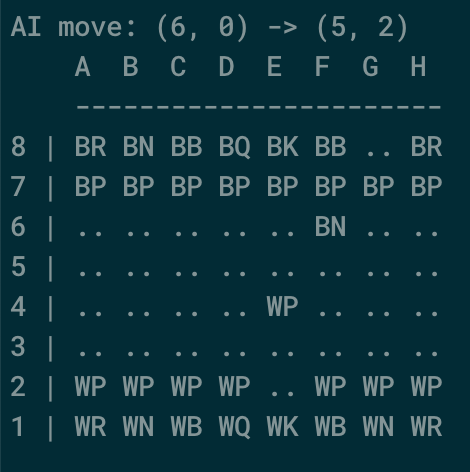

# Chess AI
Basic Chess AI written in Python 3. 

Uses the Alpha-Beta algorithm to search for the best move. 



Run the program and start playing chess! ♟️
```
python3 main.py
```

### Example Moves
Moves should have the following format:
```
A2 A4
```
This will move the piece from position A2 to A4.

